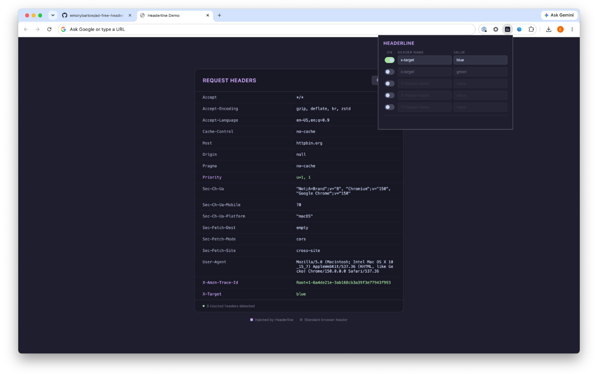

# Headerline

Lightweight Chrome extension for injecting custom HTTP request headers. Supports up to 5 independent headers, each with its own on/off toggle. Built as a minimal, ad-free alternative to ModHeader for local development and blue/green testing.

## Features

- Up to 5 named headers, each independently toggled on/off
- Changes apply instantly — no page reload required
- Settings persist across browser restarts
- Applies to all URLs and resource types
- No ads, no tracking, no account required

## Installation

### From the Chrome Web Store
*(Coming soon)*

### Manual / Developer Install
1. Clone or download this repo
2. Go to `chrome://extensions` in Chrome
3. Enable **Developer mode** (toggle in the top right)
4. Click **Load unpacked** and select this folder

## Usage

Click the extension icon to open the popup. For each header slot:
1. Enter a header name (e.g. `X-Environment`) and value (e.g. `blue`)
2. Flip the toggle to enable it

Disable a header by toggling it off. The name and value are remembered so you can re-enable it later.

## Privacy

See [PRIVACY.md](PRIVACY.md).
